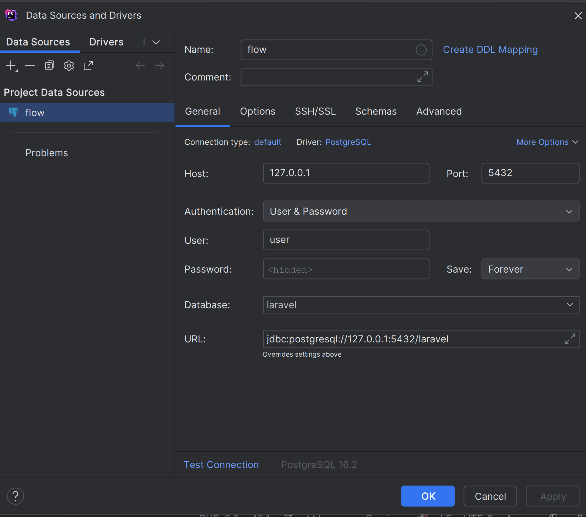

# Установка и настройка проекта

Скопировать `.env` файл из `.env.example` и указать настройки

```
cp .env.example .env
```

Прописать в `.env` параметры `APP_HOST`, `DB_PGSQL_EXT_PORT`(`DB_MYSQL_EXT_PORT`) и `COMPOSE_PROJECT_NAME` уникальными значениями

На локальном сервере добавить запись в файл hosts, указав в нём IP домен 127.0.0.1 из настройки `APP_HOST` (Инструкция https://timeweb.com/ru/docs/obshchie-voprosy/nastrojka-fajla-etc-hosts/)

> Либо использовать encrypted файл. Ключ от него отправлен в личку

### Docker

Запустить команду

```
docker network create web
docker-compose up -d --build
```

### Laravel

Заходим внутрь докера, там APP
Либо команда
```
docker-compose exec app bash
```
И запускаем следующие команды

```
composer install
php artisan key:generate
```
>Если есть проблемы с композером, то меняем на это в докер композере
```
#Docker Networks
networks:
    web:
        external: true
        driver: bridge
        driver_opts:
            com.docker.network.driver.mtu: 1450
    internal:
        external: false
        driver_opts:
            com.docker.network.driver.mtu: 1450
```
>Если есть проблемы с бд, то делаем
```
docker-compose exec pgsql bash
psql postgres
createdb laravel
```
>Проверить все можно через подключение в PHPStorm

```
php artisan migrate
php artisan storage:link
php artisan db:seed
```
Также нужно скачать с сайта https://esklp.egisz.rosminzdrav.ru/for_developers актуальный справочник и положить его в проект в папке public с  именем esklp.xml
```
php artisan queue:restart 
или 
php artisan queue:work --queue=high,default,medium,low
php artisan passport:install
php artisan config:clear
```

### Vue3
```
docker-compose exec node bash
npm install
npm run build
```
> ```npm run dev``` пока не настроил. ```npm run build``` делать каждый раз, как хочешь посмотреть изменения

### Admin

Дописываем admin к корневому адресу. 

### Cron

**Добавляем команду в crontab**

```
sh docker/cron/crontab.sh
```

> ‼ Внимание, эту команду нужно запускать в корне проекта и только 1 раз

**Включение**

Чтобы включить в файле `.env` проставьте значение `CRON_ENABLE=1`

**Рекомендации**

Сервер на котором будет развернут докер должен иметь хотя бы два ядра. В противном случае, не получиться выполнить даже простейшую миграцию

# Полезные ссылки

Первичная настройка Ubuntu
https://www.digitalocean.com/community/tutorials/initial-server-setup-with-ubuntu-18-04

Установка Docker в Ubuntu
https://www.digitalocean.com/community/tutorials/how-to-install-and-use-docker-on-ubuntu-18-04

Установка Git в Ubuntu
https://www.digitalocean.com/community/tutorials/how-to-install-git-on-ubuntu-18-04

Установка php, nginx, mysql в Docker
https://www.digitalocean.com/community/tutorials/how-to-set-up-laravel-nginx-and-mysql-with-docker-compose-ru

Установка Cron в Ubuntu
https://www.digitalocean.com/community/tutorials/how-to-use-cron-to-automate-tasks-ubuntu-1804
